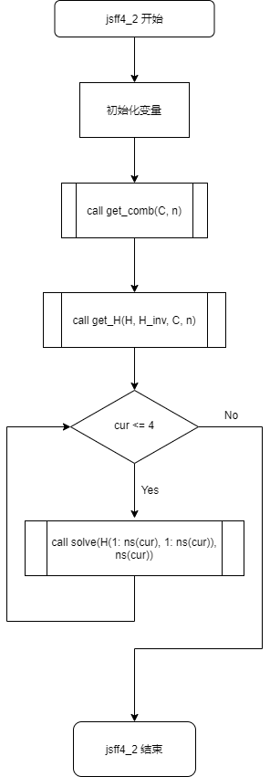
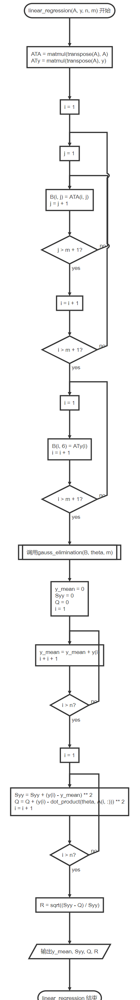
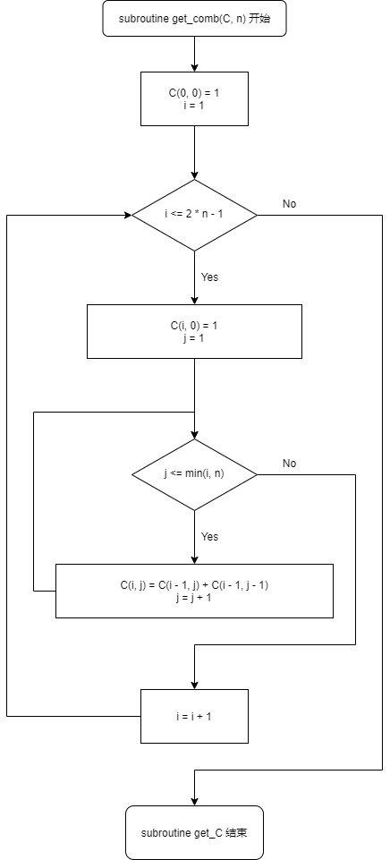
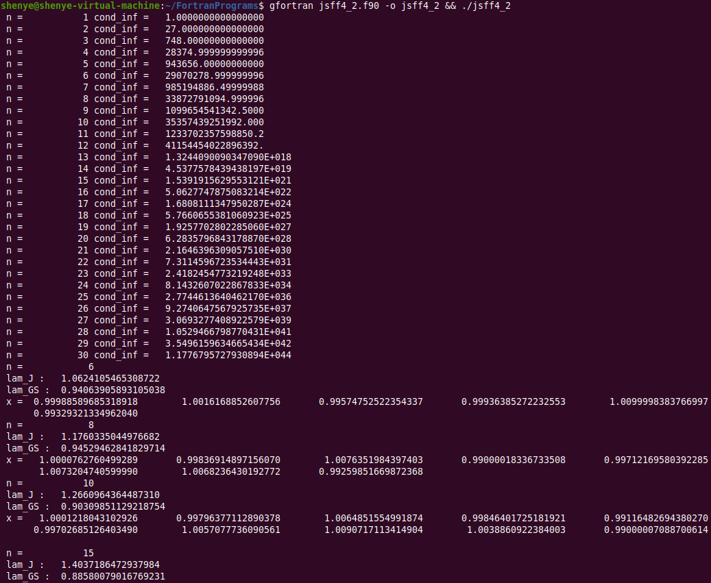
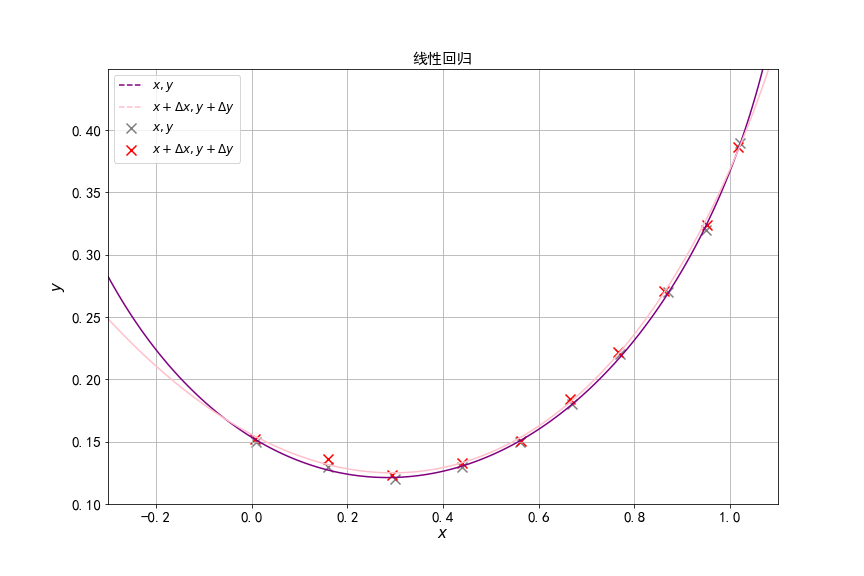
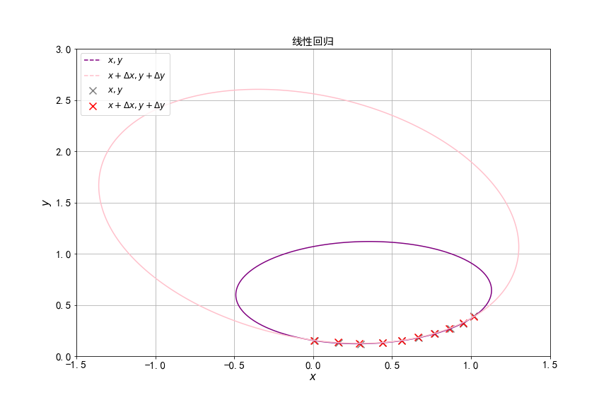
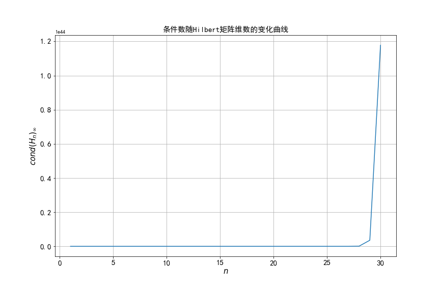
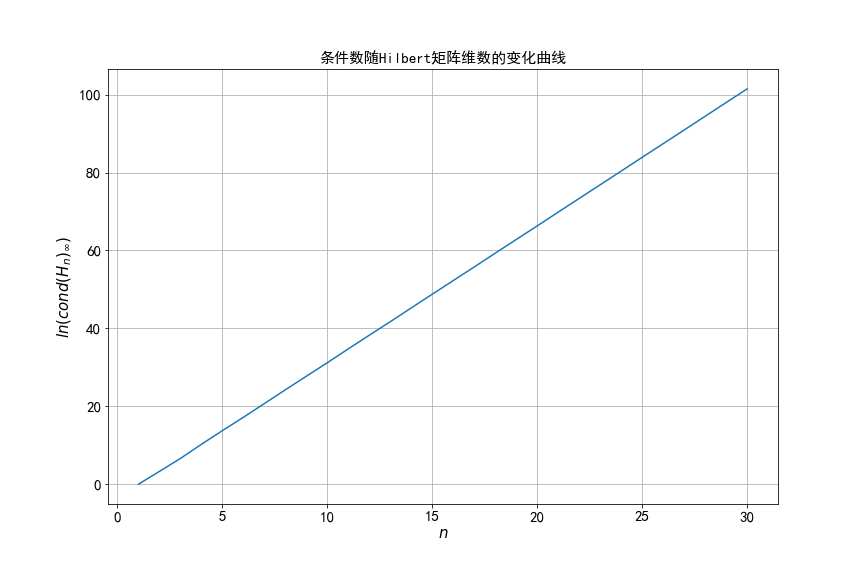
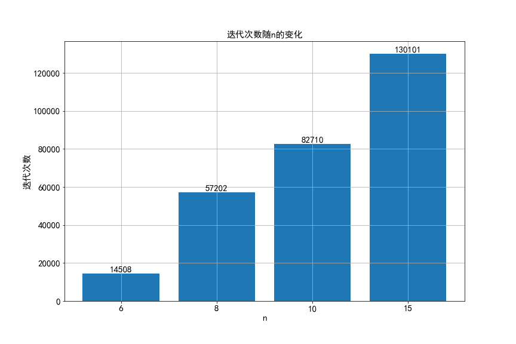

[TOC]

#计算方法上机实习四 实习报告

2019级 大气科学学院 赵志宇

学号：191830227

##一、编程流程图

##二、源代码

共两个源文件：jsff4_1.f90和jsff4_2.f90.

jsff4_1.f90解决第一题，jsff4_2.f90解决第二题.

jsff4_1.f90

~~~fortran
! jsff4_1.f90
program jsff4_1
    ! homework4_1 of Numerical Methods
    ! arthor : zzy

    implicit none
    ! dp : set presion for literal
    integer, parameter :: dp = SELECTED_REAL_KIND(15)
    ! X : x coordinates, Y : y coordinates
    real(8), dimension(10) :: X = [1.02_dp, 0.95_dp, 0.87_dp, 0.77_dp, 0.67_dp, 0.56_dp, 0.44_dp, 0.3_dp, 0.16_dp, 0.01_dp]
    real(8), dimension(10) :: Y = [0.39_dp, 0.32_dp, 0.27_dp, 0.22_dp, 0.18_dp, 0.15_dp, 0.13_dp, 0.12_dp, 0.13_dp, 0.15_dp]
    real(8), dimension(10) :: del_X = [-0.0029_dp, 0.0007_dp, -0.0082_dp, -0.0038_dp, -0.0041_dp, &
                                        0.0026_dp, -0.0001_dp, -0.0058_dp, -0.0005_dp, -0.0034_dp]
    real(8), dimension(10) :: del_Y = [-0.0033_dp, 0.0043_dp, 0.0006_dp, 0.002_dp, 0.0044_dp, &
                                        0.0009_dp, 0.0028_dp, 0.0034_dp, 0.0059_dp, 0.0024_dp]
    ! x_train : character variables in linear regression
    real(8), dimension(10, 5) :: x_train
    ! y_train : target variables in linear regression
    real(8), dimension(10) :: y_train
    ! i : loop variable, n : the number of samples, m : the number of chracters
    ! 10 points and 5 characters(1, x, y, x*y, y^2) are used in linear regression
    integer(4) :: i, n = 10, m = 5
    
    ! initialize x_train, y_train
    do i = 1, n
        x_train(i, 1) = 1
        x_train(i, 2) = X(i)
        x_train(i, 3) = Y(i)
        x_train(i, 4) = X(i) * Y(i)
        x_train(i, 5) = Y(i) * Y(i)
        y_train(i) = X(i) * X(i)
    end do

    call linear_regression(x_train, y_train, n, m)

    do i = 1, n
        x_train(i, 1) = 1
        x_train(i, 2) = X(i) + del_X(i)
        x_train(i, 3) = Y(i) + del_Y(i)
        x_train(i, 4) = (X(i) + del_X(i)) * (Y(i) + del_Y(i))
        x_train(i, 5) = (Y(i) + del_Y(i)) * (Y(i) + del_Y(i))
        y_train(i) = (X(i) + del_X(i)) * (X(i) + del_X(i))
    end do

    call linear_regression(x_train, y_train, n, m)

end program jsff4_1

subroutine linear_regression(A, y, n, m)
    ! apply linear regression algorithm
	! parameters: A : matrix of character variables, shape is (n, m)
    !             y : vector of target variables
    !             n : the number of (x, y) 
    !             m : the number of characters
	! author: zzy

    implicit none
    integer(4), intent(in) :: n, m
    real(8), dimension(n, m) :: A
    ! B : agumented matrix
    real(8), dimension(m, m + 1) :: B, B0
    real(8), dimension(n) :: y
    ! theta : solution of ATA*b == ATy 
    real(8), dimension(m) :: theta
    ! y_mean : mean value of y, Syy : variance of y, Q : sum of squared error (SSE), R : multiple correlation coefficient
    real(8) :: y_mean, Syy, Q, R
    integer(4) :: i

    ! intialize agumented matrix
    B(1: m, 1: m) = matmul(transpose(A), A)
    B(:, m + 1) = matmul(transpose(A), y)
    B0 = B

    ! solve the equation ATA*b == ATy
    call LU_factoriation(B0, theta, m)

    print *, 'b :', theta

    ! calculate y_mean, Syy, Q, R
    y_mean = 0
    Syy = 0
    Q = 0

    y_mean = sum(y) / dble(n)

    do i = 1, n
        Syy = Syy + (y(i) - y_mean) ** 2
        Q = Q + (y(i) - dot_product(theta, A(i, :))) ** 2
    end do

    R = sqrt((Syy - Q) / Syy)

    ! print *, 'y_mean :', y_mean
    ! print *, 'Syy :', Syy
    ! print *, 'Q :', Q
    ! print *, 'R :', R

end subroutine linear_regression

subroutine LU_factoriation(A, theta, n)
    ! apply LU factoriation, calculate inverse matrix of A(1:n, 1:n)
	! parameters: A : agumented matrix
    !             theta : solution of linear equations
    !             n : the length of theta is n
	! author: zzy

    implicit none
    integer(4), intent(in) :: n
    real(8), intent(in out), dimension(n, n + 1) :: A
    ! LU combines the matrix L and U (PA = LU)
    real(8), dimension(n, n) :: LU, L_inv, U_inv
    ! A(1:n, 1:n) * theta = A(:, n+1) 
    real(8), dimension(n), intent(in out) :: theta
    ! L * zeta = P * A(:, n+1)
    ! U * theta = zeta
    real(8), dimension(n) :: zeta
    ! temp : intermediate varible for vector swap
    real(8), dimension(n + 1) :: temp
    ! cond_inf : conditional number
    real(8) :: cond_inf
    ! i, j, k, r : loop varibles
    integer(4) :: i, j, k, r
    ! p : save the output of maxloc
    integer(4) :: p(1)

    do r = 1, n - 1
        ! find column pivot, and swap the rows
        p = maxloc(abs(A(r: n, r)))
        if (p(1) > r) then
            temp = A(p(1), :)
            A(p(1), :) = A(r, :)
            A(r, :) = temp
        end if

        ! calculate row r of U
        do j = r, n
            LU(r, j) = A(r, j)
            do k = 1, r - 1
                LU(r, j) = LU(r, j) - LU(r, k) * LU(k, j)
            end do
        end do

        ! calculate column r of L
        do i = r + 1, n
            LU(i, r) = A(i, r)
            do k = 1, r - 1
                LU(i, r) = LU(i, r) - LU(i, k) * LU(k, r)
            end do
            LU(i, r) = LU(i, r) / LU(r, r)
        end do
    end do

    ! calculate U(n, n)
    LU(n, n) = A(n, n)
    do k = 1, n - 1
        LU(n, n) = LU(n, n) - LU(n, k) * LU(k, n)
    end do

    ! solve L * zeta = P * A(:, n+1)
    zeta(1) = A(1, n + 1)
    do r = 2, n
        zeta(r) = A(r, n + 1)
        do j = 1, r - 1
            zeta(r) = zeta(r) - LU(r, j) * zeta(j)
        end do
    end do

    ! solve U * theta = zeta
    theta(n) = zeta(n) / LU(n, n)
    do r = n - 1, 1, -1
        theta(r) = zeta(r)
        do j = r + 1, n
            theta(r) = theta(r) - LU(r, j) * theta(j)
        end do
        theta(r) = theta(r) / LU(r, r)
    end do

    ! calc inv(U) and inv(L)
    do i = 1, n
        U_inv(i, i) = 1 / LU(i, i)
        do k = i - 1, 1, -1
            U_inv(k, i) = 0
            do j = k + 1, i
                U_inv(k, i) = U_inv(k, i) - LU(k, j) * U_inv(j, i)
            end do
            U_inv(k, i) = U_inv(k, i) / LU(k, k)
        end do
    end do

    do i = 1, n
        L_inv(i, i) = 1
        do k = i + 1, n
            L_inv(k, i) = 0
            do j = i, k - 1
                L_inv(k, i) = L_inv(k, i) - LU(k, j) * L_inv(j, i)
            end do
        end do
    end do

    cond_inf = maxval(sum(abs(A(1: n, 1: n)), 2)) * maxval(sum(abs(matmul(U_inv, L_inv)), 2))
    print *, "cond_inf :", cond_inf

end subroutine LU_factoriation

subroutine print_matrix(A, m, n)
    ! debug function, print a matrix
	! parameters: A : matrix to be printed
    !             (m, n) : shape of matrix
	! author: zzy

    implicit none
    integer(4) :: m, n, i
    real(8), dimension(m, n) :: A

    do i = 1, m
        print *, A(i, :)
    end do

end subroutine print_matrix
~~~

jsff4_2.f90

~~~fortran
program jsff4_2
    ! homework4_2 of Numerical Methods
    ! arthor : zzy

    implicit none
    integer, parameter :: dp = SELECTED_REAL_KIND(15)
    real(8), dimension(30, 30) :: H, H_inv
    real(8), dimension(0:60, 0:30) :: C
    integer(4) :: ns(4) = [6, 8, 10, 15]
    integer(4) :: cur, n = 30

    call get_comb(C, n)
    call get_H(H, H_inv, C, n)

    do cur = 1, 4
        call solve(H(1: ns(cur), 1: ns(cur)), ns(cur))
    end do

end program jsff4_2

subroutine get_comb(C, n)
    ! calculate combinatorial numbers
    ! parameters: C(m, n) : ways of choose n items out of m items
    !             n : upper bound of C
    ! author : zzy

    implicit none
    real(8), dimension(0: 2 * n, 0: n) :: C
    integer(4) :: n, i, j

    C(0, 0) = 1
    do i = 1, 2 * n - 1
        C(i, 0) = 1
        do j = 1, min(i, n)
            C(i, j) = C(i - 1, j) + C(i - 1, j - 1)
        end do
    end do

end subroutine get_comb

subroutine get_H(H, H_inv, C, n)
    ! intitalize H, calculate H_inv and cond_inf
    ! parameters: H : Hilbert maxtrix
    !             H_inv : inverse matrix of Hilbert maxtrix
    !             C : combinatorial numbers
    !             n : upper bound of shape of H
    ! author : zzy

    implicit none
    real(8), dimension(n, n) :: H, H_inv
    real(8), dimension(0: 2 * n, 0: n), intent(in) :: C
    ! cond_inf : condition number (infinity)
    real(8) :: cond_inf
    integer(4) :: n, i, j, k

    ! initialize H by its definition
    do i = 1, n
        do j = 1, n
            H(j, i) = 1 / dble(i + j - 1);
        end do
    end do

    ! calculate H_inv and cond_inf
    do k = 1, n
        do i = 1, k
            do j = 1, k
                H_inv(i, j) = (i + j - 1) * C(k + i - 1, k - j) * C(k + j - 1, k - i) * C(i + j - 2, i - 1) ** 2
                if (mod(i + j, 2) == 1) then
                    H_inv(i, j) = -H_inv(i, j)
                end if
            end do
        end do
        cond_inf = maxval(sum(abs(H(1: k, 1: k)), 2)) * maxval(sum(abs(H_inv(1: k, 1: k)), 2))
        print *, "n =", k, "cond_inf =", cond_inf
    end do

end subroutine get_H

subroutine solve(H, n)
    ! solve the given problem in homework4
    ! parameters: H : Hilbert maxtrix
    !             n : shape of H
    ! author : zzy

    implicit none
    integer, parameter :: dp = SELECTED_REAL_KIND(15)
    real(8), dimension(n, n), intent(in) :: H
    ! L : lower triangular matrix, U : upper triangular matrix, D : diagonal matrix
    ! B_J : iteration matrix B of Jacobi iteration
    ! B_GS : iteration matrix B of Gauss-Seidel iteration
    real(8), dimension(n, n) :: L, U, D, B_J, B_GS
    ! x : the solution of equation Hx = Hx*
    real(8), dimension(n) :: x
    ! lam_J : the maximum absolute eigenvalue(aka spectral radius) of B_J
    ! lam_GS : the maximum absolute eigenvalue(aka spectral radius) of B_GS 
    real(8) :: lam_J, lam_GS
    integer(4) :: n, i, j, k

    ! initialize D, L, U
    do i = 1, n
        do j = 1, n
            D(j, i) = 0.0_dp
            L(j, i) = 0.0_dp
            U(j, i) = 0.0_dp
        end do
    end do

    ! H = L + U + D
    do i = 1, n
        D(i, i) = H(i, i)
        do j = 1, i - 1
            L(i, j) = H(i, j)
        end do
        do j = i + 1, n
            U(i, j) = H(i, j)
        end do
    end do

    ! B_J = -inv(D) * (L + U)
    B_J = -H
    do j = 1, n
        B_J(j, j) = 0
    end do

    ! B_GS = -inv(L + D) * U
    ! calc inv(L + D), saved in D
    L = L + D
    do i = 1, n
        D(i, i) = 1 / L(i, i)
        do k = i + 1, n
            D(k, i) = 0
            do j = i, k - 1
                D(k, i) = D(k, i) - L(k, j) * D(j, i)
            end do
            D(k, i) = D(k, i) / L(k, k)
        end do
    end do

    B_GS = -matmul(D, U)

    ! initialize lambda
    lam_J = 1e8_dp
    lam_GS = 1e8_dp
    
    ! calculate the maximum eigenvalue by power method
    call power_method(B_J, n, 1e-2_dp, lam_J)
    call power_method(B_GS, n, 1e-2_dp, lam_GS)

    print *, "n = ", n
    print *, "lam_J :", abs(lam_J)
    print *, "lam_GS :", abs(lam_GS)

    ! solve Hx = Hx* by Gauss-Seidel iteration 
    call gauss_seidel(H, x, n, 1e-2_dp)
    print *, "x =", x

end subroutine solve

subroutine power_method(A, n, eps, lambda)
    ! apply power method to calculate the largest eigenvalue and corresponding eigenvector
    ! parameters: A : the matrix to be calculated
    !             n : shape of A is (n, n)
    !             eps : precision
    !             lambda : eigenvalue

    implicit none
    real(8), dimension(n, n) :: A
    ! v : iteration vector
    real(8), dimension(n, 2) :: v 
    real(8) :: lambda, lam_temp = 0, eps
    integer(4) :: n, i, j
    
    do i = 1, n
        do j = 1, 2
            v(i, j) = i
        end do
    end do

    do while(abs(lambda - lam_temp) > eps)
        lambda = lam_temp
        v(:, 2) = v(:, 2) / maxval(v(:, 2))
        v(:, 1) = v(:, 2)
        v(:, 2) = matmul(A, v(:, 2))
        lam_temp = dot_product(v(:, 2), matmul(A, v(:, 2))) / dot_product(v(:, 2), v(:, 2))
    end do

end subroutine power_method

subroutine gauss_seidel(A, x, n, eps)
    ! apply Gauss-Seidel iteration to solve linear equtions
    ! parameters: A : coefficient matrix
    !             x : the solution
    !             n : shape of A is (n, n)
    !             eps : precision

    implicit none
    integer, parameter :: dp = SELECTED_REAL_KIND(15)
    real(8), dimension(n, n) :: A
    ! x_star : true solution, b : Ax = b, b = x_star * H
    real(8), dimension(n) :: x, x_star, b
    real(8) :: eps
    integer(4) :: n, i, j

    do i = 1, n
        x(i) = 0.0_dp
        x_star(i) = 1.0_dp
    end do
    b = matmul(x_star, A)

    ! implement Gauss-Seidel iteration
    do while(maxval(abs(x - x_star)) > eps)
        do i = 1, n
            x(i) = b(i)
            do j = 1, i - 1
                x(i) = x(i) - A(i, j) * x(j)
            end do
            do j = i + 1, n
                x(i) = x(i) - A(i, j) * x(j)
            end do
            x(i) = x(i) / A(i, i)
        end do
    end do

end subroutine gauss_seidel

subroutine print_matrix(A, m, n)
    ! debug function, print a matrix
	! parameters: A : matrix to be printed
    !             (m, n) : shape of matrix
	! author: zzy

    implicit none
    integer(4) :: m, n, i
    real(8), dimension(m, n) :: A

    do i = 1, m
        print *, A(i, 1: n)
    end do

end subroutine print_matrix
~~~

##三、运行结果

编译指令（在jsff4_1.f90和jsff4_2.f90所在的目录执行）：

~~~shell
gfortran jsff4_1 -o jsff4_1 && ./jsff4_1
~~~

~~~shell
gfortran jsff4_2 -o jsff4_2 && ./jsff4_2
~~~

##四、分析报告

###问题1

####1.问题分析

上机实习2中的行星轨道拟合问题，$b_0+b_1x+b_2y+b_3xy+b_4y^2=x^2$.

表1：

| x    |1.02|0.95|0.87|0.77|0.67|0.56|0.44|0.30|0.16|0.01|
| ---- | ---- | ---- | ---- | ---- | ---- | ---- | ---- | ---- | ---- | ---- |
| y    |0.39|0.32|0.27|0.22|0.18|0.15|0.13|0.12|0.13|0.15|

表2：
| $\Delta$x |-0.0029|0.0007|-0.0082|-0.0038|-0.0041|0.0026|-0.0001|-0.0058|-0.0005|-0.0034|
| ---- | ---- | ---- | ---- | ---- | ---- | ---- | ---- | ---- | ---- | ---- |
| $\Delta$y |-0.0033|0.0043|0.0006|0.0020|0.0044|0.0009|0.0028|0.0034|0.0059|0.0024|

1）首先，只用表 1 的 10 个点来拟合轨道，并计算方程组系数矩阵的条件数；其次，假如 x 和 y 包含扰动 Δx 和 Δ y（表 2）对新的 x 和 y 重新拟合轨道； （要求：最小二乘法求解方程组时用 LU(主元)分解法） 

2）将 1）拟合得到的两条轨道画在同一张图上，比较差异，并讨论扰动对轨道差异的影响。

第1）问复用上机实习2的线性拟合子程序即可，需要新编写的内容是条件数的求解和用于求解最小二乘法的线性方程组的LU分解法.

第2）问使用python的matplotlib画图.

#### 2.算法细节

#####（1）LU分解的实现

采用Doolittle分解，$A=LU$​，L 为主对角线元素全为1的下三角矩阵，U 为上三角矩阵.

Doolittle分解的公式如下：
$$
\begin{aligned}
	u_{1j}&=a_{1j}\quad j=1,2,\cdots n \\
	l_{i1}&=\frac{a_{i1}}{u_{11}} \quad i=1,2,\cdots n\\
	u_{rj}&=a_{rj}-\sum_{k=1}^{r-1}l_{rk}u_{kj}\quad r=2,\cdots,n\quad j=r,\cdots,n\  \\
	l_{ir}&=\frac{a_{ir}-\displaystyle\sum_{k=1}^{r-1}l_{ik}u_{kr}}{u_{rr}}
	\quad r=2,\cdots,n-1\quad j=r+1,\cdots,n\  \\
\end{aligned}
$$
注意在计算完 U 的第r行之后要接着计算L的第r列.

注意到L的主对角线元素都为1，所以不需要单独存储矩阵 L 主对角线的值，Doolittle分解公式中也没有出现 $l_{ii}$​. 因此在实现 LU 分解时可以将矩阵 L 和 U 合并为矩阵LU以节省空间，LU 的上三角部分为 U ，下三角部分为 L ，LU 的主对角线存储U的主对角线元素. 即：
$$
\begin{aligned}
LU=
\begin{bmatrix}
u_{11} & u_{12}  & \cdots   & u_{1n}   \\
l_{21} & u_{22}  & \cdots   & u_{2n}  \\
\vdots & \vdots  & \ddots   & \vdots  \\
l_{n1} & l_{n2}  & \cdots\  & u_{nn}  \\
\end{bmatrix}
\end{aligned}
$$
在每次计算U的第r行和L的第r列之前先选出最大的主元，若$max(a_{ir})=a_{kr},r\le i, k\le n$​​，则交换A的第r行和第k行，避免出现小主元.

LU分解由子程序LU_factoriation实现.

##### （2）条件数的计算

矩阵条件数的定义：$cond(A)_v=\Vert A^{-1}\Vert_v\Vert A\Vert_v$.

常用的条件数为 v = 2 与 v = $\infty$​，在本题中使用易于计算的$cond(A)_{\infty}=\Vert A^{-1}\Vert_\infty\Vert A\Vert_\infty$​.

完成A的LU分解后，A的逆矩阵可简单地由$A^{-1}=U^{-1}L^{-1}$​计算，只需要计算上三角矩阵 U 和下三角矩阵 L 的逆即可.

矩阵的无穷范数为每行绝对值之和的最大值，使用Fortran内置的maxval, sum, abs函数进行计算.

sum的第二个参数为求和方向，为2代表按行求和.

~~~fortran
cond_inf = maxval(sum(abs(A(1: n, 1: n)), 2)) * maxval(sum(abs(matmul(U_inv, L_inv)), 2))
~~~

条件数的计算在子程序LU_factoriation中实现.

####3.编程思路

主要子程序：

linear_regression(x_train, y_train, n, m) 实现线性回归

LU_factoriation(A, theta, n) 实现LU分解和条件数计算

####4.运行结果分析

图中紫色曲线和灰色散点对应未加扰动的结果，粉色曲线和红色散点对应加上微小扰动的结果.

从图中可以看出，当x和y有微小扰动时，拟合出的曲线有很大的变化.​​​

计算所得的条件数为821263.5，方程组$A^TAx=A^Ty$​的病态性质明显.

### 问题2

####1.问题分析

以Hilbert矩阵为系数的线性方程组，其真解为 $(1, 1,\cdots, 1)^T$ ，体会病态方程组求解的稳定性问题.
$$
\begin{aligned}
H_n=
\begin{bmatrix}
1 & \frac{1}{2}  & \cdots   & \frac{1}{n}   \\
\frac{1}{2} & \frac{1}{3}  & \cdots   & \frac{1}{n+1}  \\
\vdots & \vdots  & \ddots   & \vdots  \\
\frac{1}{n} & \frac{1}{n+1}  & \cdots\  & \frac{1}{2n-1}  \\
\end{bmatrix}
\end{aligned}
$$
1）给出条件数随矩阵的维数n增大的变化曲线；若分别取 n=6，n=8，n=10，n=15， 用迭代法解方程组（Jacobi 迭代和 Gauss-Seidel 二选一，根据收敛条件判断），比较求解结果与真解； 

2）讨论用迭代法求解病态方程组时，是否与直接法存在相同的问题？如果存在差异，如何理解造成这种差异的原因.

第1）问依然使用容易计算的 $cond(H_n)_\infty$​​​. 通过计算迭代矩阵B的谱半径来决定使用的迭代算法.

#### 2.算法细节

##### （1）H~n~条件数的计算

可以给出$H_n^{-1}$​的表达式（引自$MathOverflow$​​）：
$$
\begin{aligned}
(H_n^{-1})_{ij}&=(-1)^{i+j}(i+j-1)\dbinom{n+i-1}{n-j}\dbinom{n+j-1}{n-i}\dbinom{i+j-2}{i-1}^2 \\
\dbinom{n}{k}&=\frac{n!}{k!(n-k)!}
\end{aligned}
$$
先通过递推的方式计算出杨辉三角（组合数），再计算$H_n^{-1}$，存储在二维数组H_inv中.

对于k阶Hilbert矩阵，条件数的计算由以下语句实现：

~~~fortran
cond_inf = maxval(sum(abs(H(1: k, 1: k)), 2)) * maxval(sum(abs(H_inv(1: k, 1: k)), 2))
~~~

##### （2）谱半径的计算

$B_J=-D^{-1}(L+U),B_{GS}=-(D+L)^{-1}U$​

使用幂法计算迭代矩阵 B_J 和 B_GS 的绝对值最大的特征值（即谱半径）.

##### （3）G-S迭代法的实现

$$
\begin{aligned}
	A&=D+L+U\\
	Ax&=b \Rightarrow (D+L)x = -Ux + b\\
	x^{(k+1)}&=D^{-1}Lx^{(k+1)}-D^{-1}Ux^{(k)}+D^{-1}b\\
	x_i^{(k+1)}&=\frac{1}{a_{ii}}(b_{i}-\sum_{j=1}^{i-1}a_{ij}x_j^{(k+1)}-\sum_{j=i+1}^{n}a_{ij}x_j^{(k)})
\end{aligned}
$$

只需要一个数组 x(n)，对于 x(j)，当 j < i 时 x(j) 为第k + 1次迭代的结果，当 j > i 时 x(j) 为第k次迭代的结果.

待解的方程组为 $H_nx=b, $​其中$b=H_nx^{*},x^*=(1,1,\cdots,1)^T$​​​.​

G-S迭代由子程序gauss_seidel实现.

#### 3.编程思路

主要子程序：

get_comb(C, n) 通过递推得到组合数

get_H(H, H_inv, C, n) 计算H，H_inv和条件数.

solve(H, n) 计算迭代矩阵B_J和B_GS的谱半径，根据谱半径的值选择执行G-S迭代.

power_method(A, n, eps, lambda) 实现幂法

gauss_seidel(A, x, n, eps) 实现G-S迭代

print_matrix(A, m, n) 打印矩阵，调试时使用

#### 4.运行结果分析

#####（1）条件数随矩阵的维数 n 增大的变化曲线

图1：

图2：

图一为$cond(H_n)_{\infty}-n$曲线，图二为$ln[cond(H_n)_{\infty}]-n$曲线.

从上面两张图可以看出，随着矩阵维数 n 的增大，H_n的条件数呈指数级增长.

由运行结果可知，n = 6, 8, 11, 15时，Jacobi迭代矩阵的谱半径均大于1，G-S迭代矩阵的谱半径均小于1，因此选择G-S迭代法.

#####（2）讨论用迭代法求解病态方程组时，是否与直接法存在相同的问题？如果存在差异，如何理解造成这种差异的原因。

直接法和迭代法在求解病态方程组时存在的问题不同.

直接法的问题是舍入误差使得求出的解相对误差过大.

迭代法的问题是收敛速度较慢. 在本次实验中迭代次数随 n 的变化如下（eps = 1e-2）：

从图中可以看出即使要得到一个精度不高的解也需要大量的迭代次数. 

实际上，当eps = 1e-3， n = 15时，迭代次数达到2738110；当eps = 1e-4， n = 15 时，程序已经无法在五分钟之内运行完成（CPU 型号为i5-8265U，主频为1.80 GHz）.

差异的原因是直接法试图找到线性方程组的解析解，在计算解析解的过程中舍入误差的累积使得最终求出的解的误差很大.

而迭代法可以通过调整迭代算法减小谱半径，保证迭代能够收敛到一个较为精确的解.
