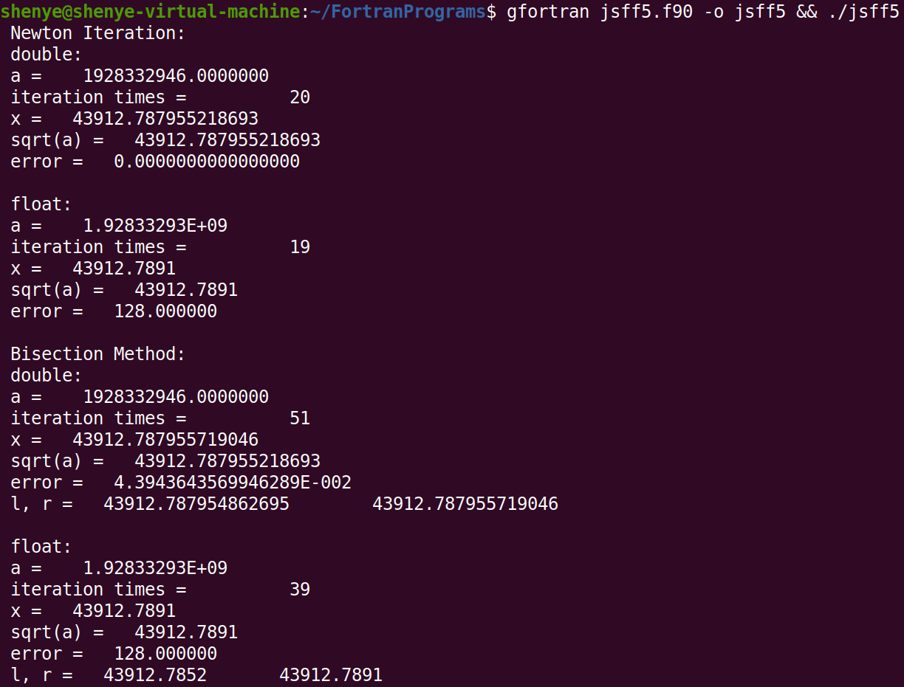

[TOC]

#计算方法上机实习五 实习报告

2019级 大气科学学院 赵志宇

学号：191830227

##一、编程流程图

##二、源代码

源文件：jsff5.f90

~~~fortran
program jsff5
    ! homework5 of Numerical Methods
    ! arthor : zzy

    implicit none
    integer, parameter :: dp = SELECTED_REAL_KIND(15)

    call newton_iteration(1928332946.0_dp, 1e-6_dp)
    call bisection(1928332946.0_dp, 1e-6_dp)
    
end program jsff5

subroutine newton_iteration(a_double, eps)
    ! apply newton iteration
    ! parameters: a_double : double_precision of a
    !             eps : precision

    implicit none
    ! x_double, x_double_temp : variables used in iteration
    real(8) :: x_double, x_double_temp, a_double, eps
    ! x_float, x_float_temp : variables used in iteration
    real(4) :: x_float, x_float_temp, a_float
    ! cnt_double, cnt_float : record the iteration times
    integer(4) :: cnt_double = 0, cnt_float = 0

    ! initialize variables
    a_float = sngl(a_double)
    x_double = a_double
    x_float = a_float

    ! iteration of double precision variable
    x_double_temp = x_double - 0.5 * (x_double - a_double / x_double)
    do while(abs(x_double - x_double_temp) > eps)
        x_double = x_double_temp
        x_double_temp = x_double - 0.5 * (x_double - a_double / x_double)
        cnt_double = cnt_double + 1
    end do

    ! iteration of single precision variable
    x_float_temp = x_float - 0.5 * (x_float - a_float / x_float)
    do while(abs(x_float - x_float_temp) > eps)
        x_float = x_float_temp
        x_float_temp = x_float - 0.5 * (x_float - a_float / x_float)
        cnt_float = cnt_float + 1
    end do

    ! output the result
    print *, "Newton Iteration:"
    print *, "double:"
    print *, "a = ", a_double
    print *, "iteration times =", cnt_double
    print *, "x =", x_double
    print *, "sqrt(a) =", sqrt(a_double)
    print *, "error =", abs(x_double * x_double - a_double)
    
    
    print *, "float:"
    print *, "a = ", a_float
    print *, "iteration times =", cnt_float
    print *, "x =", x_float
    print *, "sqrt(a) =", sqrt(a_float)
    print *, "error =", abs(x_float * x_float - a_float)

end subroutine newton_iteration

subroutine bisection(a_double, eps)
    ! apply bisection method
    ! parameters: a_double : double_precision of a
    !             eps : precision

    implicit none
    ! l_double, r_double : lower and upper bound of current interval
    ! x_double : the solution
    real(8) :: l_double, r_double, x_double, a_double, eps
    ! l_float, r_float : lower and upper bound of current interval
    ! x_float : the solution
    real(4) :: l_float, r_float, x_float, a_float
    ! cnt_double, cnt_float : record the iteration times
    integer(4) :: cnt_double = 0, cnt_float = 0

    ! initialize variables
    a_float = sngl(a_double)

    l_double = 0
    r_double = a_double

    ! bisection
    do while(abs(r_double - l_double) > eps)
        x_double = l_double + 0.5 * (r_double - l_double)
        if (x_double * x_double > a_double) then
            r_double = x_double
        else
            l_double = x_double
        end if
        cnt_double = cnt_double + 1
    end do

    ! initialize variables
    l_float = 0
    r_float = a_float
    x_float = l_float + 0.5 * (r_float - l_float)

    ! bisection
    do while(abs(r_float - l_float) > eps)
        x_float = l_float + 0.5 * (r_float - l_float)
        if (x_double * x_double > a_double) then
            if(abs(l_float - x_float) < eps) then
                exit
            end if
            l_float = x_float
        else
            if(abs(r_float - x_float) < eps) then
                exit
            end if
            r_float = x_float
        end if
        cnt_float = cnt_float + 1
    end do

    print *, "Bisection Method:"
    print *, "double:"
    print *, "a = ", a_double
    print *, "iteration times =", cnt_double
    print *, "x =", x_double
    print *, "sqrt(a) =", sqrt(a_double)
    print *, "error =", abs(x_double * x_double - a_double)
    
    
    print *, "float:"
    print *, "a = ", a_float
    print *, "iteration times =", cnt_float
    print *, "x =", x_float
    print *, "sqrt(a) =", sqrt(a_float)
    print *, "error =", abs(x_float * x_float - a_float)

end subroutine bisection
~~~

##三、运行结果

编译指令（在jsff5.f90所在的目录执行）：

~~~shell
gfortran jsff5 -o jsff5 && ./jsff5
~~~

##四、分析报告

###1.问题分析

通过使用迭代法解非线性方程$f(x)=x^2-a=0$来计算$sqrt(a)$，其中a=1928332946.

（1）用牛顿迭代法求解，输出开方结果（精度要求 10-6）和迭代次数；

（2）用二分法求解，输出开方结果（精度同上）和二分次数，对比运算速度；

要求（1）和（2）的计算过程中采用单精度、双精度各算一遍，并与用内部函数 sqrt(a) 直接计算的结果对比.

分析：按照要求使用相应的算法计算即可.

### 2.算法细节

####（1）Newton迭代法的实现

Newton迭代法的公式为$x_{k+1}=x_k-\frac{f(x_k)}{f^\prime(x_k)},(k=0,1,2\cdots)$.

函数$f(x)=x^2-a,f^\prime(x)=2x,f^{\prime\prime}(x)=2$​​​，选取初始值$x_0=a$.

以下条件成立：

1）$f(0)=-a<0,f(a)=a^2-a>0,f(0)f(a)<0$​，$f(x)=0$在区间$[0,a]$上有根.

2）$f^{\prime}(x)$在$[a,b]$上连续不变号，且$f^{\prime\prime}(x)\ne0$.

3）$f(x_0)f^{\prime\prime}(x_0)>0$.

所以Newton迭代收敛.

Newton迭代法在子程序newton_iteration中实现.

#### （2）二分法的实现

二分法的伪代码：

**While**  (r - l) > eps do

​		x = r + (r - l) / 2

​		**if** (sign(f(l)) == sign(f(x))) then

​				l = x

​		**else**

​				r = x

​		**end**

**end**

$f(0)<0,f(a)>0$, 选取初始区间为$[0,a]$.

由于存在浮点误差，单精度的二分法无法收敛，因此多加了一个判断条件，当本次迭代得到的 x 与上一次迭代得到的 x 的差的绝对值小于精度 eps 时停止迭代.

Newton迭代法在子程序bisection中实现.

###3.编程思路

主要子程序：

newton_iteration(a_double, eps) 实现Newton迭代

bisection(a_double, eps) 实现二分法

###4.运行结果分析

#### （1）Newton迭代

对于双精度变量： 

迭代次数 = 20

x = 43912.787955218693     

库函数sqrt(a) = 43912.787955218693     

误差(x * x - a) =   0.0000000000000000     

对于单精度变量：

迭代次数 = 19

x =   43912.7891    

库函数sqrt(a) =   43912.7891    

误差(x * x - a) =   128.000000

#### （2）二分法

对于双精度变量： 

迭代次数 = 51

x = 43912.787955719046   

库函数sqrt(a) = 43912.787955218693     

误差(x * x - a) = 4.3943643569946289E-002     

对于单精度变量：

迭代次数 = 39

x =   43912.7891    

库函数sqrt(a) =   43912.7891    

误差(x * x - a) =   128.000000   

注：eps=1e-6时，单精度的二分法无法收敛，因此增加了一个停止迭代的条件，当本次迭代得到的 x 与上一次迭代得到的 x 的差的绝对值小于精度 eps 时停止迭代.

#### (3)分析

首先进行不同迭代方法之间的比较. 从结果可以看出，无论是单精度还是双精度，在同样的精度要求下，Newton迭代法的收敛速度快于二分法.

然后在同一种迭代方法中对比双精度与单精度的区别. 在Newton迭代和二分法中，单精度所需的迭代次数均小于双精度，单精度的计算误差均大于双精度.

注意到使用单精度变量计算出的 x 的平方的绝对误差达到了128，远大于双精度产生的误差.

原因如下：

1）单精度浮点数有23个尾数位，再加上默认的有效数位1，能表示24位二进制数字. 但是二进制下 a = 1110010111100000000011010010010，共有31位，末尾的7位（即0010010）将被截断. 所以将 a 赋值给单精度变量将产生$(0010010)_2=(18)_{10}$​​的误差. （$(number)_k$​​代表k进制数）

2）当迭代进行到 x 接近于 sqrt(a) 时，x 的整数部分等于 43912. 而$(43912)_{10}=(1010101110001000)_2$​，共有16个二进制位，因此小数部分只能占据 8 个二进制位，这意味着 x 所能达到的最高精度为 $2^{-8}=0.00390625$​​ ，远大于eps=1e-6.

这也解释了单精度在二分法中不收敛. 因为在计算过程中区间长度(r - l)的最小值为0.00390625，大于eps，所以迭代不可能停止.

事实上，在退出循环时，l_float = 43912.7852，r_float = 43912.7891，两者之差正好为0.0039.

同理，双精度变量有52个尾数位，加上默认的有效位1，能表示53位二进制数字. 去掉整数部分的16位，有37位留给了小数部分. 所以双精度变量所能达到的最高精度为$2^{-37}\approx7.276\times10^{-12}$​，​远小于eps=1e-6，因此双精度变量能够满足精度要求.

