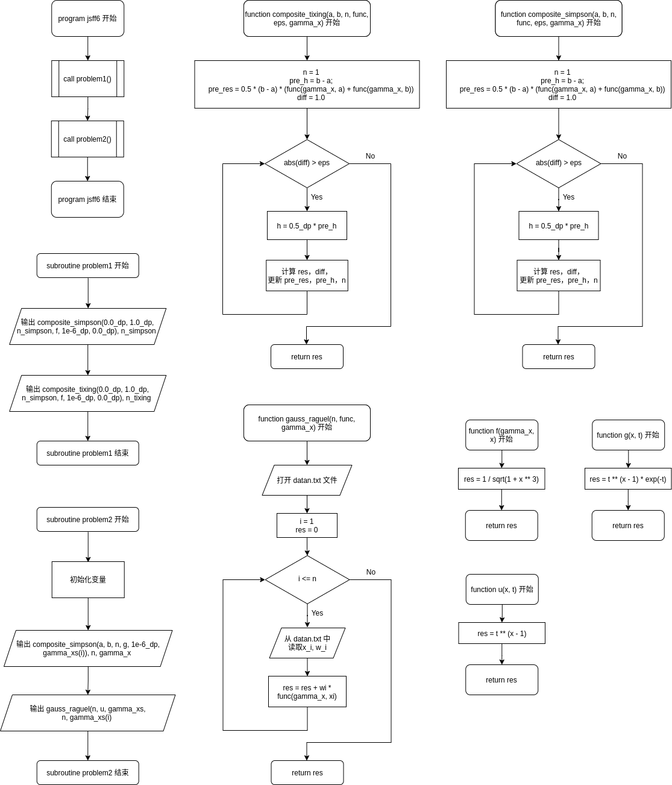
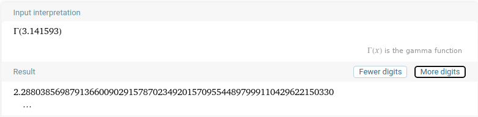

[TOC]
# 计算方法上机实习六 实习报告

2019级 大气科学学院 赵志宇

学号：191830227

## 一、编程流程图

## 二、源代码

源文件：jsff6.f90, jsff6_1.f90, jsff6_2.f90, functions.f90

~~~fortran
! jsff6.f90
program jsff6
    ! homework6 of Numerical Methods
    ! author : zzy
    
    implicit none
    call problem1();
    call problem2();
end program jsff6
~~~

~~~fortran
! jsff6_1.f90
subroutine problem1()
    ! homework6 problem1 of Numerical Methods
    implicit none
    integer, parameter :: dp = selected_real_kind(15)
    real(8), external :: f, composite_simpson, composite_tixing
    integer :: n_simpson, n_tixing

    print *, "Problem 1"
    print *, composite_simpson(0.0_dp, 1.0_dp, n_simpson, f, 1e-6_dp, 0.0_dp), n_simpson
    print *, composite_tixing(0.0_dp, 1.0_dp, n_tixing, f, 1e-6_dp, 0.0_dp), n_tixing, "\n"

end subroutine problem1
~~~

~~~fortran
! jsff6_2.f90
subroutine problem2()
    ! homework6 problem3 of Numerical Methods
    implicit none
    integer, parameter :: dp = selected_real_kind(15)
    real(8), external :: g, u, composite_simpson, composite_tixing, gauss_raguel
    real(8), dimension(5) :: gamma_xs = [1.0_dp, 5.0_dp, 10.0_dp, 2.333333_dp, 3.141593_dp]
    real(8) :: a = 0.0_dp, b = 60.0_dp
    integer :: n, i
    
    print *, "Problem 2" 

    print *, "Composite Simpson:"
    print *, "\tresult\t\t\t     n\t\t  x"
    do i = 1, 5
        print *, composite_simpson(a, b, n, g, 1e-6_dp, gamma_xs(i)), n, gamma_xs(i)
    end do

    n = 5
    print *, "Gauss-Raguel:"
    print *, "\tresult\t\t\t     n\t\t  x"
    do i = 1, 5
        print *, gauss_raguel(n, u, gamma_xs(i)), n, gamma_xs(i)
    end do

end subroutine problem2
~~~

~~~fortran
! functions.f90
! the funtions used in main routines
function f(gamma_x, x)
    ! return f(x)
    implicit none
    real(8) :: f, gamma_x, x
    f = 1 / sqrt(1 + x ** 3)
    return
end function f

function g(x, t)
    ! function used to calculate gamma function
    implicit none
    real(8) :: g, x, t
    g = t ** (x - 1) * exp(-t)
    return
end function g

function u(x, t)
    ! function used in Gauss-Raguel integral
    implicit none
    real(8) :: u, x, t
    u = t ** (x - 1)
    return
end function u

function composite_tixing(a, b, n, func, eps, gamma_x)
    ! apply variable step trapezium composite quadrature
    ! parameters: a, b: integral interval boundray (a, b)
    !             n: number of small intervals
    !             func: integral function func(x)
    !             eps: precision
    !             gamma_x: parameter x in gamma function
    implicit none
    integer, parameter :: dp = selected_real_kind(15)
    real(8) :: composite_tixing
    real(8), external :: func
    real(8), intent(in) :: a, b, eps, gamma_x
    ! h: h_{2N}, pre_h: h_N, res: S_{2N}, pre_res: S_N, diff: the error of res
    real(8) :: h, pre_h, res, pre_res, diff
    integer, intent(in out) :: n
    integer :: i

    n = 1
    pre_h = b - a;
    pre_res = 0.5 * (b - a) * (func(gamma_x, a) + func(gamma_x, b))
    diff = 1.0

    do while(abs(diff) > eps)
        res = 0_dp
        h = 0.5_dp * pre_h

        do i = 1, n
            res = res + func(gamma_x, a + (2.0_dp * dble(i) - 1) * h)
        end do

        res = 0.5_dp * pre_res + h * res
        diff = (res - pre_res) / 3.0_dp
        pre_h = h
        pre_res = res
        n = n * 2
    end do

    composite_tixing = res
    return
end function composite_tixing

function composite_simpson(a, b, n, func, eps, gamma_x)
    ! apply variable step simpson composite quadrature
    ! parameters: a, b: integral interval boundray (a, b)
    !             n: the number of small intervals
    !             func: integral function func(x)
    !             gamma_x: parameter x in gamma function
    implicit none
    integer, parameter :: dp = selected_real_kind(15)
    real(8) :: composite_simpson
    real(8), external :: func
    real(8), intent(in) :: a, b, eps, gamma_x
    ! h: h_{2N}, pre_h: h_N, res: S_{2N}, pre_res: S_N, diff: the error of res
    real(8) :: h, pre_h, res, pre_res, diff
    integer, intent(in out) :: n
    integer :: i

    n = 1
    pre_h = b - a;
    pre_res = (b - a) * (func(gamma_x, a) + 4.0_dp * func(gamma_x, 0.5_dp * (a + b)) + func(gamma_x, b)) / 6.0_dp
    diff = 1.0

    do while(abs(diff) > eps)
        h = 0.5_dp * pre_h
        res = 0.0_dp

        do i = 1, 2 * n
            res = res + 2.0_dp * func(gamma_x, a + (dble(i) - 0.5_dp) * h)
        end do
        do i = 1, n
            res = res - func(gamma_x, a + (2.0_dp * dble(i) - 1.0_dp) * h)
        end do

        res = 0.5_dp * pre_res + h * res / 3.0_dp
        diff = (res - pre_res) / 15.0_dp
        pre_h = h
        pre_res = res
        n = n * 2
    end do

    composite_simpson = res
    return
end function composite_simpson

function gauss_raguel(n, func, gamma_x)
    ! apply Gauss-Raguel integral
    ! parameters: n: the number of small intervals
    ! func: integral function
    ! gamma_x: parameter x in gamma function
    implicit none
    integer, parameter :: dp = selected_real_kind(15)
    ! wi: coefficients, xi: nodes
    real(8) :: gauss_raguel, xi, wi, res
    real(8), external :: func
    real(8), intent(in) :: gamma_x
    integer, intent(in) :: n
    integer :: i
    character(2) :: str

    ! transfer integer to string
    write(str,"(i0)") n
    ! open ./nodes/datan.txt
    open(1, file='./nodes/data' // trim(adjustl(str)) // '.txt', status='old')
    res = 0.0_dp
    do i = 1, n
        read(1, *) xi, wi
        res = res + wi * func(gamma_x, xi)
    end do
    close(1)

    gauss_raguel = res
    return
end function gauss_raguel
~~~

## 三、运行结果

编译指令（在Makefile所在目录执行）：

~~~shell
make run
~~~
或者运行以下指令，直接从github获取代码：

~~~shell
git clone ssh://njuzzy.top:6000/srv/git/numericalMethods.git && cd numericalMethods/作业6 && make run
~~~

## 四、分析报告

### 问题1

#### 1.问题分析

要求使用变步长积分法计算如下的定积分值：
$$
I=\int_0^1\frac{dx}{\sqrt{1+x^3}}
$$
算法 1：利用复化辛普森公式进行计算，逐渐增加区间个数 n，直至前后两次积
分值之差小于 $10^{-6}$.
算法 2：利用复化梯形公式重复上述计算.

通过对比上述两种方法计算结果的收敛速度，理解这两种方法的优劣。

#### 2.算法细节

##### （1）变步长复化梯形积分的实现

课本上给出了变步长复化梯形积分公式：
$$
\begin{aligned}
T_{2N}=\frac{1}{2}T_N+h_{2N}\sum_{k=1}^{N}f(a+(2k-1)h_{2N})\\
\end{aligned}
$$
其中$N$为区间等分数，$f(x)$为被积函数，$h_{N}$为步长.

代入公式即可.

变步长复化梯形积分在 functions.f90 中的 function composite_tixing 中实现.

##### （2）变步长复化辛普森积分的实现

首先推导变步长复化辛普森积分公式.

由课本P124式（5.36）得，
$$
\begin{aligned}
S_{N} = \frac{4T_{2N}-T_N}{3}, S_{2N} = \frac{4T_{4N}-T_{2N}}{3}
\end{aligned}
$$
将$T_{4N},T_{2N},T_{N}$用变步长复化梯形积分展开，
$$
\begin{aligned}
T_{2N}&=\frac{1}{2}T_N+h_{2N}\sum_{k=1}^{N}f(a+(2k-1)h_{2N})\\
T_{4N}&=\frac{1}{2}T_{2N}+h_{4N}\sum_{k=1}^{2N}f(a+(2k-1)h_{4N})\\
&=\frac{1}{4}T_N+\frac{1}{2}h_{2N}\sum_{k=1}^{N}f(a+(2k-1)h_{2N})+\frac{1}{2}h_{2N}\sum_{k=1}^{2N}f(a+\frac{2k-1}{2}h_{2N})\\
\end{aligned}
$$
用$S_{2N}-\frac{1}{2}S_N$，得
$$
\begin{aligned}
S_{2N}-\frac{1}{2}S_N = \frac{1}{3}(4T_{4N}-3T_{2N}+\frac{1}{2}T_{N})
= h_{2N}\sum_{k=1}^{2N}2f(a+\frac{2k-1}{2}h_{2N})-h_{2N}\sum_{k=1}^{N}f(a+(2k-1)h_{2N})
\end{aligned}
$$
即
$$
S_{2N}=\frac{1}{2}S_N +h_{2N}\sum_{k=1}^{2N}2f(a+\frac{2k-1}{2}h_{2N})-h_{2N}\sum_{k=1}^{N}f(a+(2k-1)h_{2N})
$$

然后代入公式即可.

变步长复化辛普森积分在 functions.f90 中的 function composite_simpson 中实现.

#### 3.编程思路

主要函数：

f(gamma_x, x)：计算$f(x)=\frac{1}{\sqrt{1+x^3}}$，第一个参数 gamma\_x 是为了使求积函数与第二问兼容，在第一问中用不到.

composite_tixing(a, b, n, func, eps, gamma_x)：实现变步长复化梯形积分.

composite_simpson(a, b, n, func, eps, gamma_x)：实现变步长复化辛普森积分.

#### 4.运行结果分析

辛普森积分：积分值为 0.90960463457311702，区间个数 n 为 8.

梯形积分：积分值为 0.90960356828782429，区间个数 n 为 256. 

在 Wolfram Alpha[2] 上得到的积分值如下图所示：

精度 eps = 1e-6 时，辛普森积分得到的结果与参考值的小数点前六位相同，梯形积分与参考值的小数点前六位相差0.000001.

可以看出辛普森积分收敛更快且误差更小，所以辛普森积分优于梯形积分.

### 问题2

#### 1.问题分析

Gamma函数定义如下：
$$
\Gamma(x)=\int_{0}^{\infty}t^{x-1}e^{-t}dt,\ x>0
$$
a) 对无限的积分区间进行截断，使用复化积分公式（自由选取梯形或辛普森）来计算 Gamma 函数值。通过实验和分析探索来决定截断的范围，主要是考虑到
效率和精度之间的平衡.
b) 高斯拉盖尔积分（Gauss-Laguerre or Gauss-Raguel）是用来计算在区间 $[0, \infty]$，权重函数为 $e^{-t}$ 的积分. 通过查看参考资料（比如数学手册），找到高斯拉盖尔积分公式的积分节点及求积公式系数，计算 Gamma 函数值.
对上面两种方法，选取在 1 和 10 之间的几个 x，求 Gamma 函数的值. 选取一个的精度，比较不同方法的效率.

分析：对于a)，由第一问可知，辛普森积分在收敛速度和精度上都优于梯形积分，因此选择辛普森积分. 对于b)，代入公式即可

#### 2.算法细节

##### （1）Gauss-Raguel积分的实现

Gauss-Raguel积分公式如下：
$$
\int_{0}^{\infty}e^{-t}u(x,t)dt=\sum_{i=1}^{N}w_i\cdot u(x,t_i)
$$
其中 $w_i$，$t_i$ 分别为积分系数和积分节点.

在本题中 $u(x,t)=t^{x-1}$ 代入公式即可.

Gauss-Raguel积分在 functions.f90 中的 function gauss_raguel 中实现.

##### （2）$w_i$，$t_i$ 的获取

$t_i$ 为拉盖尔多项式（Raguel polynomial）$L_n(t)$ 的第 n 个根，$w_i$ 由以下的式子给出[1]：
$$
w_i=\frac{t_i}{(n+1)^2[l_{n+1}(t_i)]^2}
$$
以下的 python 程序将 n = 5, ... 40 的 $t_i$，$w_i$ 输出到文件 data5.txt, ... data40.txt（需要安装 sympy 库）：

~~~python
#!/usr/bin/env python3
from sympy import *

def lag_weights_roots(n):
    x = Symbol('x')
    roots = Poly(laguerre(n, x)).all_roots()
    x_i = [rt.evalf(20) for rt in roots]
    w_i = [(rt/((n+1)*laguerre(n+1, rt))**2).evalf(20) for rt in roots]
    return x_i, w_i

for i in range(5, 41):
    file_path = './nodes/'
    file_name = 'data' + str(i) + '.txt'
    with open(file_path + file_name, 'w') as f:
        for j in range(i):
            f.write(str(lag_weights_roots(i)[0][j]) + ' ' + str(lag_weights_roots(i)[1][j]) + '\n')
~~~

随后 fortran 的 gauss_raguel 函数只需要在 datan.txt 中读取 $w_i$，$t_i$ 即可.

#### 3.编程思路

主要函数：

g(x, t)：计算 Gamma 函数中的被积函数 $t^{x-1}e^{-t}$.

u(x, t)：计算 $u(x, t) = t^{x-1}$.

gauss_raguel(n, func, gamma_x)：实现 Gauss-Raguel 积分

#### 4.运行结果分析

对于辛普森积分，设定精度 eps = 1e-6，改变 x，观察区间个数 n；

对于 Gauss-Raguel 积分，设定区间个数 n，改变 x，观察精度变化.

辛普森积分：
|积分值|区间个数 n|x|
|------|-|-|
|  1.0000000654568622       |       512 |  1.0000000000000000     |
|  23.999999796514452       |       256 |  5.0000000000000000     |
|  362880.00000000128       |       256 |  10.000000000000000     |
|57.261293398457610     |         128 |  5.5555550000000000|
|  2.2880380403238654       |       512 |  3.1415929999999999 |

Gauss-Raguel 积分：
|积分值|区间个数 n|x|
|------|-|-|
|0.99999999999999989 |           5  | 1.0000000000000000     |
|23.999999999999996   |           5  | 5.0000000000000000     |
|362879.99999999988   |            5 |  10.000000000000000     |
|57.261285393129086     |          20 |  5.5555550000000000 |
| 2.2880387032435197        |       60 |  3.1415929999999999 |

根据 Gamma 函数的性质 $\Gamma(N) = (N-1)!$，可知当 x = 1.0, 5.0, 10.0 时，辛普森积分取 512 或 256 个区间，Gauss-Raduel 积分取 5 个区间，后者精度高于前者.

当 x 不是整数时，将积分值与 Wolfram Alpha 给出的参考值做比较.

在 Wolfram Alpha 上得到的积分值如下图所示：

当 x = 5.555555 时，辛普森积分取 128 个区间，Gauss-Radeul 积分取 20 个区间，后者精度高于前者；

当 x = 3.141593 时，辛普森积分取 512 个区间，Gauss-Radeul 积分取 60 个区间，后者精度高于前者.

在所取的样本点中，Gauss-Raduel 积分均优于辛普森积分.

## 五、参考

[1] Wikipedia, Gauss-Laguerre quadrature https://en.wikipedia.org/wiki/Gauss%E2%80%93Laguerre_quadrature#Generalized_Gauss%E2%80%93Laguerre_quadrature

[2] Wolfram Alpha https://www.wolframalpha.com/
