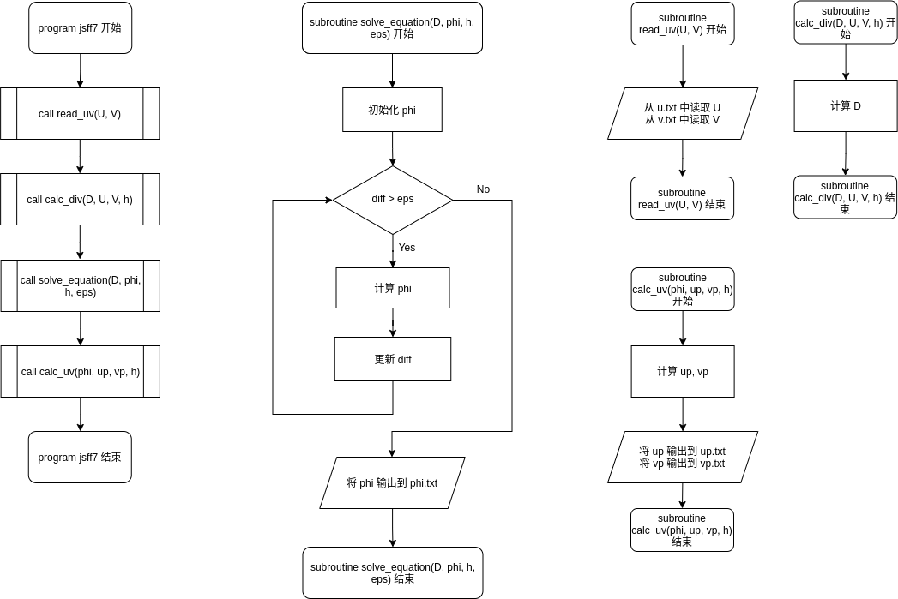
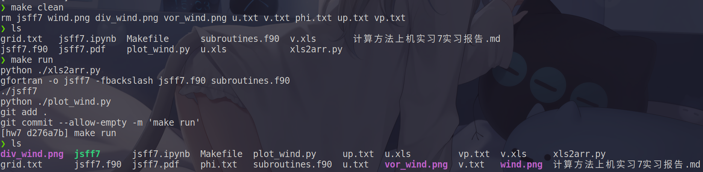
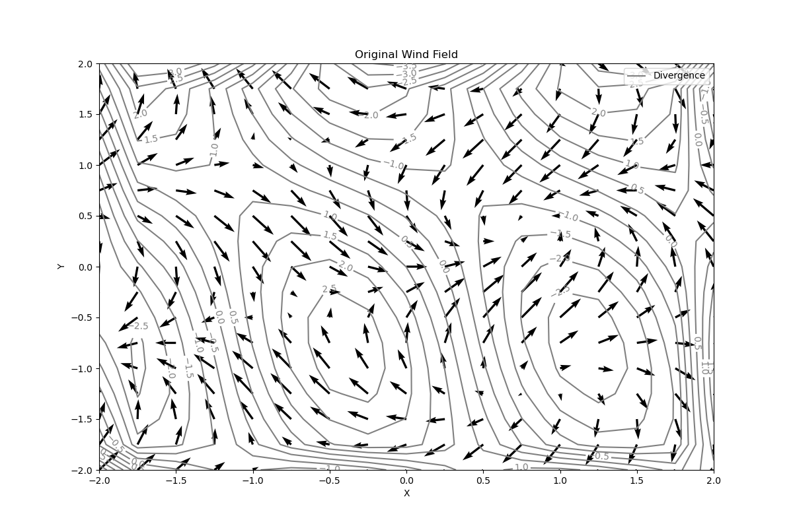
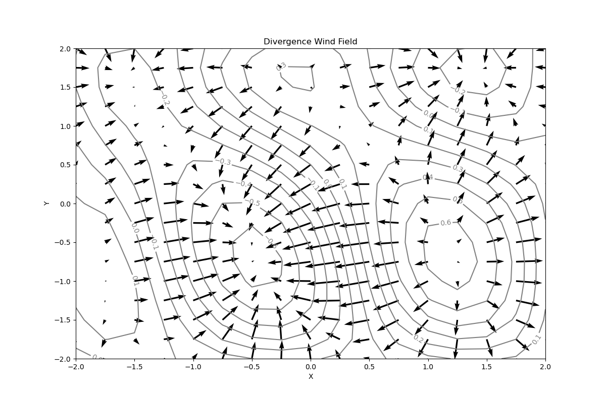
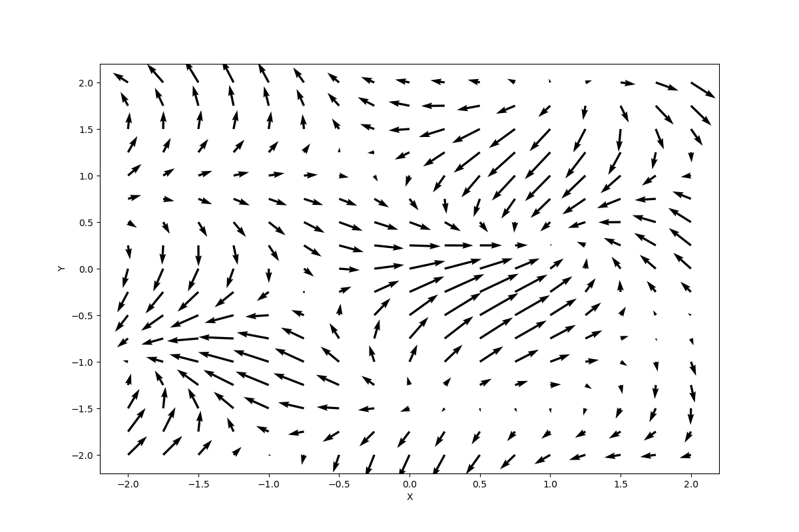

[TOC]
# 计算方法上机实习七 实习报告

2019级 大气科学学院 赵志宇

学号：191830227

## 一、编程流程图

## 二、源代码

源文件：jsff7.f90, subroutines.f90

辅助工具：xls2arr.py（将 .xls 文件转化成 fortran 容易读取的 .txt 文件）, plot_wind.py（绘制风场）

~~~fortran
! jsff7.f90
program jsff7
    implicit none
    integer, parameter :: dp = selected_real_kind(15)
    real(8) :: U(0:18, 0:18), V(0:18, 0:18)
    real(8) :: U_p(17, 17), V_p(17, 17)
    real(8) :: D(17, 17)
    real(8) :: phi(0:18, 0:18)

    call read_uv(U, V)
    call calc_div(D, U, V, 0.25_dp)
    call solve_equation(D, phi, 0.25_dp, 1e-7_dp)
    call calc_uv(phi,U_p, V_p, 0.25_dp)
end program jsff7
~~~

~~~fortran
! subroutines.f90
subroutine read_uv(U, V)
    implicit none
    real(8) :: U(0:18, 0:18), V(0:18, 0:18)

    open(1, file='u.txt', status='old')
    read(1, *) U
    close(1)
    
    open(2, file='v.txt', status='old')
    read(2, *) V
    close(2)

end subroutine

subroutine calc_div(D, U, V, h) 
    implicit none
    integer, parameter :: dp = selected_real_kind(15)
    real(8) :: U(0:18, 0:18), V(0:18, 0:18)
    real(8) :: D(17, 17)
    real(8) :: h
    integer :: i, j

    do i = 1, 17
        do j = 1, 17
            D(i, j) = (U(i + 1, j) - U(i - 1, j)) / (2.0_dp * h)&
                    + (V(i, j + 1) - V(i, j - 1)) / (2.0_dp * h)
        end do
    end do

end subroutine calc_div 

subroutine solve_equation(D, phi, h, eps)
    implicit none
    integer, parameter :: dp = selected_real_kind(15)
    real(8), intent(in) :: D(17, 17), h, eps
    real(8), intent(in out) ::  phi(0:18, 0:18)
    real(8) :: R 
    real(8) :: alpha = 1.6_dp, diff = 1.0_dp
    integer i, j
    
    do i = 0, 18
        do j = 0, 18
            phi(i, j) = 0.0_dp
        end do
    end do

    do while(diff > eps)
        diff = 1e-8_dp
        do i = 1, 17
            do j = 1, 17
                R = (phi(i + 1, j) + phi(i, j + 1)&
                        + phi(i - 1, j) + phi(i, j - 1) - 4.0_dp * phi(i, j)) - D(i, j) * h * h
                phi(i, j) = phi(i, j) + 0.25_dp * alpha * R
                diff = max(diff, abs(0.25_dp * alpha * R))
            end do
        end do
    end do
    
    open(1, file='phi.txt')
    write(1, *) phi(1:17, 1:17)
    close(1)

end subroutine solve_equation

subroutine calc_uv(phi, U_p, V_p, h)
    implicit none
    integer, parameter :: dp = selected_real_kind(15)
    real(8), intent(in) :: phi(0:18, 0:18)
    real(8) :: U_p(17, 17), V_p(17, 17)
    real(8) :: h
    integer :: i, j

    do i = 1, 17
        do j = 1, 17
            U_p(i, j) = (phi(i - 1, j) - phi(i + 1, j)) / (2.0_dp * h)
            V_p(i, j) = (phi(i, j - 1) - phi(i, j + 1)) / (2.0_dp * h)
        end do
    end do 

    open(1, file='up.txt')
    write(1, *) U_p
    close(1)

    open(2, file='vp.txt')
    write(2, *) V_p
    close(2)

end subroutine calc_uv
~~~

~~~python
# xls2arr.py
import pandas as pd
import numpy as np
import re

x = np.linspace(-2.25, 2.25, 19)
y = np.linspace(-2.25, 2.25, 19)
grid = np.meshgrid(x, y)

dfU = pd.read_excel('u.xls', usecols=range(1, 18))
dfV = pd.read_excel('v.xls', usecols=range(1, 18))

U = dfU.values.transpose()
V = dfV.values.transpose()
U = np.insert(U, 0, values=np.zeros(17), axis=0)
U = np.insert(U, 18, values=np.zeros(17), axis=0)
U = np.insert(U, 0, values=np.zeros(19), axis=1)
U = np.insert(U, 18, values=np.zeros(19), axis=1)
V = np.insert(V, 0, values=np.zeros(17), axis=0)
V = np.insert(V, 18, values=np.zeros(17), axis=0)
V = np.insert(V, 0, values=np.zeros(19), axis=1)
V = np.insert(V, 18, values=np.zeros(19), axis=1)

np.set_printoptions(linewidth=np.inf)
with open('u.txt', 'w') as f:
    f.write(' ')
    f.write(re.sub('[\[\]]', '', np.array_str(U)))
    f.close()

with open('v.txt', 'w') as f:
    f.write(' ')
    f.write(re.sub('[\[\]]', '', np.array_str(V)))
    f.close()

with open('grid.txt', 'w') as f:
    f.write(' ')
    f.write(re.sub('[\[\]]', '', np.array_str(grid[0].transpose())))
    f.write('\n\n ')
    f.write(re.sub('[\[\]]', '', np.array_str(grid[1].transpose())))
    f.close()
~~~

~~~python
# plot_wind.py
import matplotlib.pyplot as plt
import pandas as pd
import numpy as np

# initial gird
x = np.linspace(-2, 2, 17)
y = np.linspace(-2, 2, 17)
x, y = np.meshgrid(x, y)

#read U, V
dfU = pd.read_excel('u.xls', usecols=range(1, 18))
dfV = pd.read_excel('v.xls', usecols=range(1, 18))

U = dfU.values
V = dfV.values

#read u_prime, v_prime, phi
up = []
vp = []
phi = []
with open('up.txt', 'r') as f:
    for line in f:
        up = list(map(float, line.split()))
    f.close()

with open('vp.txt', 'r') as f:
    for line in f:
        vp = list(map(float, line.split()))
    f.close()

with open('phi.txt', 'r') as f:
    for line in f:
        phi = list(map(float, line.split()))
    f.close()

up = np.array(up).reshape(17, 17)
vp = np.array(vp).reshape(17, 17)
phi = np.array(phi).reshape(17, 17)

# plot original wind field
plt.subplots(figsize=(12, 8))

plt.xlabel('X')
plt.ylabel('Y')

plt.quiver(x, y, U, V)
plt.title('Original Wind Field')
plt.savefig('wind.png')
plt.close()

# plot div wind field
plt.subplots(figsize=(12, 8))

plt.xlabel('X')
plt.ylabel('Y')

#  contourf = plt.contourf(x, y, phi, cmap='flag')
contour = plt.contour(x, y, phi, np.arange(-0.8, 0.601, 0.1), colors='k', linestyles='-')
plt.quiver(x, y, up, vp)
plt.clabel(contour, fontsize=10, colors='gray')
#  plt.colorbar(contourf, drawedges=True, orientation='vertical',spacing='uniform')
plt.title('Divergence Wind Field')
plt.savefig('div_wind.png')
plt.close()

# plot vor wind field
plt.subplots(figsize=(12, 8))

plt.xlabel('X')
plt.ylabel('Y')

plt.quiver(x, y, U - up, V - vp)
plt.title('Vortex Wind Field')
plt.savefig('vor_wind.png')
plt.close()
~~~

## 三、运行结果

编译指令（在Makefile所在目录执行）：

~~~shell
make run
~~~
或者运行以下指令，直接从github获取代码：

~~~shell
git clone https://github.com/ZZY000926/numericalMethods.git && cd numericalMethods/作业7 && make run
~~~

截图：

## 四、分析报告

### 1.问题分析

已知某区域纬向风场 u (u.xls)和经向风场 v (v.xls)，用差分格式求解该区域的速度势函数及相应的辐散风分布.
$$
\begin{aligned}
\frac{\partial^2\phi}{{\partial x}^2} + \frac{\partial^2\phi}{{\partial y}^2} = -\nabla\cdot \vec{V} = -D \quad\quad &(1)\\
u^{\prime} = - \frac{\partial \phi}{\partial x} \quad\quad\quad\quad\quad\quad\quad\quad\quad\ \  &(2)\\
v^{\prime} = - \frac{\partial \phi}{\partial y} \quad\quad\quad\quad\quad\quad\quad\quad\quad\ \  &(3)\\
\end{aligned}
$$
步骤：

1）根据给出 u, v 求出对应每个格点上的散度值 D(i, j)；

2）构造二阶差分格式，采用超松弛迭代法求解泊松方程 (1)，得到每个格点上的速度势函数 φ(i, j)；

3）用 φ(i, j) 代入公式（2）和（3），分别求出辐散风分量，将势函数叠加辐散风场画出该区域的空间分布图.

分析：按照步骤实现即可.

### 2.算法细节

#### （1）文件的读入

由于 Fortran 对 .xls 文件的读入方式较为繁琐，所以先用 Python 将 .xls 文件转换为 .txt 文件（python 文件名：xls2arr.py），然后 Fortran 直接在 .txt 文件中读取数据.

为了方便后面的计算，在将 .xls 转换为 .txt 后在区域的边缘加了一圈 0 .

#### （2）散度 D(i, j) 的计算

使用中心差分进行计算，公式如下：
$$
D_{i, j} = \frac{u_{i+1,j}-u_{i-1,j}}{2\Delta x} + \frac{v_{i,j+1}-v_{i,j-1}}{2\Delta y}=\frac{u_{i+1,j}-u_{i-1,j} + v_{i,j+1}-v_{i,j-1}}{2\Delta h} \\
\Delta x = \Delta y = \Delta h=0.25
$$
散度的计算由子程序 calc_div(D, U, V, h) 实现

#### （3）泊松方程的求解

使用超松弛迭代法（SOR）进行求解方程（1），公式如下：
$$
\left\{
\begin{aligned}

R_{i,j}^{(v,v+1)}&=\frac{\phi_{i+1,j}^{(v)}+\phi_{i,j+1}^{(v)}+\phi_{i-1,j}^{(v+1)}+\phi_{i,j-1}^{(v+1)}-4\phi_{i,j}^{(v)}}{{(\Delta h)}^2}-D_{i, j} \\\\
\phi_{i,j}^{(v+1)} &= \phi_{i,j}^{(v)} + \frac{\alpha}{4}{(\Delta h)}^2R_{i,j}^{(v,v+1)}
\end{aligned}
\right.
\\
\Delta x = \Delta y = \Delta h =0.25,\ \alpha=1.6
$$
初值为 $\phi_{i,j}^{(0)}=0$，迭代终止判据为 ${\lvert {\phi_{i,j}^{(v+1)} - \phi_{i,j}^{(v)}} \rvert}_{max} \lt 10^{-7}$ .

泊松方程的求解由子程序 solve_equation(D, phi, h, eps) 实现.

### 3.编程思路

主要子程序：

read_uv(U, V)：从 u.txt 和 v.txt 中读取风速分量；

calc_div(D, U, V, h) ：计算散度；

subroutine solve_equation(D, phi, h, eps)：解泊松方程；

calc_uv(phi, U_p, V_p, h)：由速度势 $\phi$ 计算辐散风；

### 4.运行结果分析

原风场图：

势函数叠加辐散风场图：

从辐散风场图中可以看出，原风场在 (-0.5, -0.75) 和 (1.5, 1.75) 处有较强的辐合，在 (1.25, -0.5) 处有较强的辐散.
